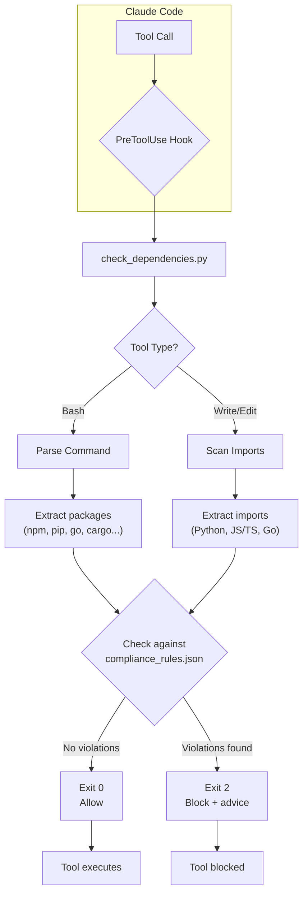

<div align="center">

# check-deps

Claude Code PreToolUse hook that blocks prohibited dependencies before they hit your codebase. Intercepts package install commands and file imports to enforce dependency policies defined in `compliance_rules.json`.

[](LICENSE)

⭐ If you like this project, star it on GitHub!

[Overview](#overview) • [Features](#features) • [Quick Start](#quick-start) • [How It Works](#how-it-works) • [Testing](#testing)

</div>

## Overview

`check-deps` is a security guard for your project's dependency ecosystem. It integrates with Claude Code as a PreToolUse hook to intercept:

- **Package install commands**: `npm install`, `pip install`, `yarn add`, `go get`, etc.
- **File imports**: Python `import`, JavaScript/TypeScript `require()`/`import`, Go imports

When a blocked package is detected, the tool execution is blocked with a clear remediation message.

> [!TIP]
> This hook runs **before** tools execute, catching policy violations at the source rather than during CI builds or runtime.

## Features

- **13 package managers**: npm, yarn, pnpm, bun, pip, uv, poetry, go, cargo, gem, composer
- **Multi-language import detection**: Python, JavaScript, TypeScript, Go
- **Smart parsing**: Version specifiers, scoped packages (`@scope/pkg`), flags, sudo/env prefixes, command chains
- **Config-driven**: Edit `compliance_rules.json`, no code changes needed
- **Fail-open design**: Missing or malformed config doesn't block; warnings to stderr
- **Zero dependencies**: Python stdlib only, Python 3.10+

## Quick Start

### 1. Install the hook

Clone the repository and copy the required files to your project:

```bash
git clone https://github.com/tanRdev/claude-code-check-deps.git
```

Copy the three required files to your project:

Required file structure:

```
your-project/
├── .claude/
│   └── settings.json
├── compliance_rules.json
└── hooks/
    └── check_dependencies.py
```

### 2. Configure the hook

Add the hook wiring to `.claude/settings.json`:

```json
{
  "hooks": {
    "PreToolUse": [
      {
        "matcher": "Bash|Write|Edit",
        "hooks": [
          {
            "type": "command",
            "command": "python3 hooks/check_dependencies.py"
          }
        ]
      }
    ]
  }
}
```

### 3. Define blocked packages

Configure `compliance_rules.json` with packages to block:

```json
{
  "blocked_packages": {
    "moment": "Use date-fns instead (smaller, immutable, tree-shakeable)",
    "requests": "Use httpx instead (async support, HTTP/2)",
    "lodash": "Use native ES methods or lodash-es for tree-shaking",
    "urllib3": "Use httpx instead"
  }
}
```

### 4. Reload Claude Code

That's it. When blocked packages are detected:

```
Policy Violation: Blocked dependencies detected

  ✗ "moment": Use date-fns instead (smaller, immutable, tree-shakeable)
  ✗ "requests": Use httpx instead (async support, HTTP/2)

Remove or replace the blocked packages to proceed.
```

## How It Works



### Command Parsing

The hook splits commands on `&&`, `||`, `;`, `|` to detect install commands across chains:

```bash
npm install moment@2.29.4 --save    # Detects: moment
sudo pip install requests            # Detects: requests
npm install foo && pip install bar   # Detects: foo, bar
```

### Import Detection

**Python:**
```python
import requests              # Blocked
from requests import get    # Blocked (top-level package)
from .local import utils    # Allowed (relative import)
```

**JavaScript/TypeScript:**
```javascript
import moment from 'moment'   // Blocked
require('moment')             // Blocked
import('./utils')             // Allowed (relative)
```

**Go:**
```go
import "github.com/user/moment"  // Blocked (matches "moment")
import "./utils"                  // Allowed (relative)
```

> [!NOTE]
> Relative imports (`./foo`, `../bar`) are always allowed.

## Testing

Test the hook manually:

```bash
# Block (exit 2)
echo '{"tool_name":"Bash","tool_input":{"command":"npm install moment"}}' | python3 hooks/check_dependencies.py

# Allow (exit 0)
echo '{"tool_name":"Bash","tool_input":{"command":"npm install date-fns"}}' | python3 hooks/check_dependencies.py

# Block Python imports
echo '{"tool_name":"Write","tool_input":{"file_path":"app.py","content":"import requests"}}' | python3 hooks/check_dependencies.py

# Block JavaScript imports
echo '{"tool_name":"Edit","tool_input":{"file_path":"app.ts","new_string":"import moment from '\''moment'\''"}}' | python3 hooks/check_dependencies.py
```

Run the test suite:

```bash
python3 -m unittest discover -s tests -p 'test*.py'
```

## Project Structure

```
.
├── hooks/
│   └── check_dependencies.py    # Main hook implementation
├── tests/
│   └── test_check_dependencies.py  # Unit tests
├── compliance_rules.json        # Blocked packages configuration
├── LICENSE                      # MIT License
└── README.md                    # This file
```

## Known Limitations

- Does not parse `requirements.txt`, `package.json`, `go.mod` inline references (skips `-r requirements.txt`)
- Go path matching uses last segment only (intentional — blocks `github.com/user/moment` when `moment` is banned)
- Cannot analyze dynamic package specs (e.g., `pip install $(cat pkg.txt)`)

## Related

- [Claude Code Hooks Documentation](https://docs.anthropic.com/en/docs/claude-code/hooks)
- [compliance_rules.json schema](./compliance_rules.json)
- [Hook source code](./hooks/check_dependencies.py)

## License

MIT License — see [LICENSE](./LICENSE) for details.
